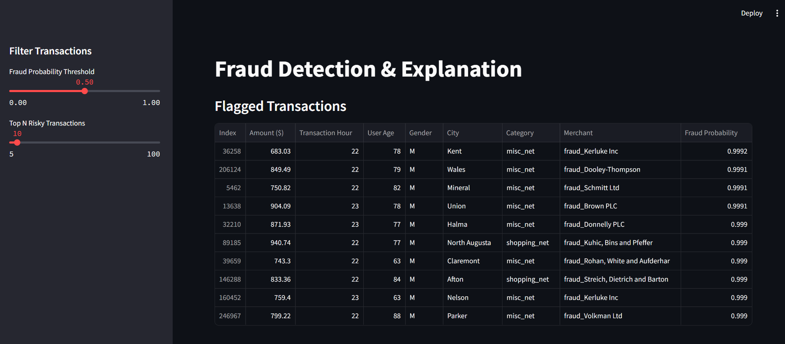
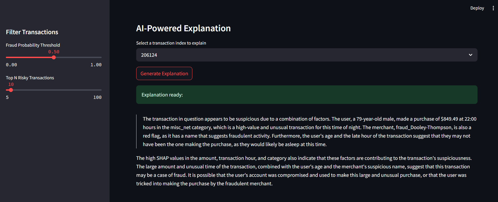

# AI-Powered Financial Fraud Detection with Explainability


This project is an end-to-end pipeline for detecting financial fraud using machine learning and large language models (LLMs). It not only predicts fraudulent transactions with high accuracy but also explains the reasoning behind each prediction using SHAP (SHapley Additive exPlanations) and natural language generated by the LLaMA-3 model via the Groq API. The solution includes a user-facing interactive dashboard built with Streamlit, enabling seamless visualization and analysis.

- **Transaction Analysis Dashboard:**

- **LLM Explanation Output:** 



## Features

- **Fraud Detection:** Utilizes XGBoost trained on real transaction data.
- **Model Interpretability:** Employs SHAP to reveal feature contributions to fraud predictions.
- **Natural Language Explanation:** Generates clear, holistic explanations using a Groq-hosted LLaMA-3 model.
- **Interactive Dashboard:** Built with Streamlit for filtering, analyzing, and visualizing transactions and explanations.


## How to Run

1. **Clone the Repository:**
   ```bash
   git clone https://github.com/Priyal43/fraud_detection_llm.git
   cd fraud_detection_llm
2. **Set Up the Environment:**
    ```bash
    python -m venv env
    # On macOS/Linux:
    source env/bin/activate
    # On Windows:
    env\Scripts\activate
3. **Install Dependencies:**
    ```bash
    pip install -r requirements.txt
4. **Set Up Environment Variables:**
Create a `.env` file in the project root with the following content:
    ```bash
    GROQ_API_KEY=your_groq_api_key_here
5. **Train the Model:**
    ```bash
    python main.py
6. **Run the Dashboard:**
    ```bash
    streamlit run dashboard/app.py
## Dataset
This project uses the [Credit Card Fraud Detection Dataset](https://www.kaggle.com/datasets/kartik2112/fraud-detection) available on Kaggle. Please download the raw dataset from Kaggle and place the files in the data/raw/ folder. Processed data files are not tracked in the repository to keep it lightweight.


